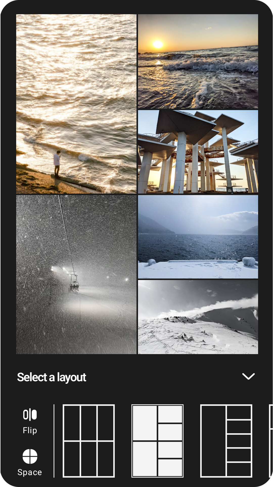

<p align="center">
    
</p>

# Tiles
A Jetpack Compose layout to tile photos together in creative ways.
Tiles not only provides several layouts to start from, but each layout can also be customized by dragging the edges and corners to frame your images as you like. 
Images can also be zoomed, moved and swapped with other images. 

To use this layout, just use the composable `TileGridLayout` like the following example:
```kotlin
TileGridLayout(
    tiles = imagesToShow,
    order = imageOrder,
    tree = layoutTree,
    isLayoutFlipped = false,
    spacing = 1.dp,
) {
    // handle tile click
}
```

This library is still a work in progress with the following changes planned:
- switch the tree to a graph and allow nodes to freely merge and travel along all edges
- video support
